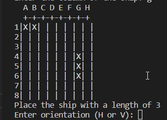

# **_Battleships_**

Battleship (also known as Battleships or Sea Battle) is a strategy type guessing game for two players. It is played on ruled grids (paper or board) on which each player's fleet of warships are marked. The locations of the fleets are concealed from the other player.

Welcome to Battleships <a href="https://ewancolquhoun.github.io/wawaswoods/index.html" target="_blank" rel="noopener">Wawas Woods</a>

# Contents

* [**User Experience UX**](<#user-experience-ux>)
    *  [User Stories](<#user-stories>)
    
    * [Game Structure](<#site-structure>)
    * [Design Choices](<#design-choices>)
    
    *  [Colour Scheme](<#colour-scheme>)
* [**Features**](<#features>)

    

   
    * [**Future Features**](<#future-features>)
* [**Technologies Used**](<#technologies-used>)
* [**Testing**](<#testing>)
* [**Deployment**](<#deployment>)
* [**Credits**](<#credits>)
    * [**Content**](<#content>)
    * [**Media**](<#media>)
*  [**Acknowledgements**](<#acknowledgements>)

# User Experience (UX)

## User Stories

* As a user I want to be able to navigate through the game easily.
* As a user I want to easily play the game
* As a user I want to be able to see easy instructions.
* As a user I want to see if I can win the game.
* As a user I want to play again.

[Back to top](<#contents>)

## Game Structure

In battleships I wanted to structure the game where we look at the grid and make is visiable to see the row
and column of the game. It is a 2D array and I used - as a miss and X as a hit to indicate whether the ship has been hit or not.

[Back to top](<#contents>)
## Design Choices
    The design choice was to go for an 8x8 grid which is a good size for all the ships to be able to place on the board and I used lines to create the board and used a seperator on the top to give distance with the Letters and the board

* ### Colour Scheme
      The colour scheme I chose is basic white for this game.

[Back to top](<#contents>)
# Features

This battleship game has a few features that make it a little more advance.

## Existing Features  
  * ### Battleships

    * You can place the ships anywhere on the board either Horizontal or Vertical.
    * You can play against the computer that places random battleships on the board.

[Back to top](<#contents>)

## Future Features 

* A better colour scheme to make it look more pretty and to make it a better eye catcher for when people are playing it.
   
* To improve the AI so it is more intelligent.
    * The computer can be more clever when picking ships
* Improve the design so by adding more layouts instead of just using a basic 2d version.

[Back to top](<#contents>)

# Technologies Used
* [HTML5](https://html.spec.whatwg.org/) - provides the content and structure for the website.
* [CSS](https://www.w3.org/Style/CSS/Overview.en.html) - provides the styling.
* [Balsamiq](https://balsamiq.com/wireframes/) - used to create the wireframes.
* [Gitpod](https://www.gitpod.io/#get-started) - used to deploy the website.
* [Github](https://github.com/) - used to host and edit the website.

[Back to top](<#contents>)

# Testing

Please refer to [**_here_**](TESTING.md) for more information on testing Wawas Woods.

[Back to top](<#contents>)

# Deployment

### **To deploy the project**
The site was deployed to GitHub pages. The steps to deploy a site are as follows:
  1. In the GitHub repository, navigate to the **Settings** tab.
  2. Once in Settings, navigate to the **Pages** tab on the left hand side.
  3. Under **Source**, select the branch to **master**, then click **save**.
  4. Once the master branch has been selected, the page will be automatically refreshed with a detailed ribbon display to indicate the successful deployment.

  The live link to the Github repository can be found here - https://github.com/EwanColquhoun/wawaswoods

### **To fork the repository on GitHub**
A copy of the GitHub Repository can be made by forking the GitHub account. This copy can be viewed and changes can be made to the copy without affecting the original repository. Take the following steps to fork the repository;
1. Log in to **GitHub** and locate the [repository](https://github.com/EwanColquhoun/wawaswoods).
2. On the right hand side of the page inline with the repository name is a button called **'Fork'**, click on the button to create a copy of the original repository in your GitHub Account.

### **To create a local clone of this project**
The method from cloning a project from GitHub is below:

1. Under the repository’s name, click on the **code** tab.
2. In the **Clone with HTTPS** section, click on the clipboard icon to copy the given URL.

3. In your IDE of choice, open **Git Bash**.
4. Change the current working directory to the location where you want the cloned directory to be made.
5. Type **git clone**, and then paste the URL copied from GitHub.
6. Press **enter** and the local clone will be created.

[Back to top](<#contents>)

# Credits
### Content

* The font came from [Google Fonts](https://fonts.google.com/).
* The map is embedded from [Google Maps](https://www.google.com/maps).
* The colour palate was compiled by [Colormind](http://colormind.io/).
* The icons came from [Font Awesome](https://fontawesome.com/).
* The form validation idea came from a [YouTube tutorial](https://www.youtube.com/watch?v=fNcJuPIZ2WE).
* The code for the Safari specific styling was inspired by an example on [Stack Overflow](https://stackoverflow.com/).
* The inspiration for the Project page sliders came from this repository on [GitHub](https://gist.github.com/zhilinskiy/4603199).
* [Balsamiq](https://balsamiq.com/wireframes/) was used to create the wireframes.

### Media
* The photos all came from the developer, [Ewan Colquhoun](https://www.linkedin.com/in/ewan-colquhoun-2b3535213/).
* The photos were compressed using [Compressor](https://compressor.io/).

[Back to top](<#contents>)

# Acknowledgements
The site was completed as a Portfolio 1 Project piece for the Full Stack Software Developer (e-Commerce) Diploma at the [Code Institute](https://codeinstitute.net/). As such I would like to thank my mentor [Precious Ijege](https://www.linkedin.com/in/precious-ijege-908a00168/), the Slack community, and all at the Code Institute for their help and support. Wawas Woods is a fictional company but it exists in everything but the business title. Currently it is more of a hobby!

Ewan Colquhoun 2021.

[Back to top](<#contents>)