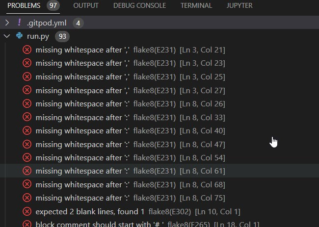

# **_Battleships_**

Battleship (also known as Battleships or Sea Battle) is a strategy type guessing game for two players. It is played on ruled grids (paper or board) on which each player's fleet of warships are marked. The locations of the fleets are concealed from the other player.
# ** -------BATTLESHIPS------- **
    Pre-reqs: Loops, Strings, Arrays, 2D Arrays, Global Variables, Methods
    How it will work:
    1. A 8x8 grid will have 5 ships of different length randomly placed about
    2. You will have your own board to place your own ships
    3. You can choose H (horizontal) or V (Vertical) to place ships
    4. You will be asked for the row and column
    5. After all ships placed you can start the game
        you will pick a row and column to target ship.
    6. If all ships are sinked before the computer, you win
        else, you lose if computer sinks your ships
    Legend:
    1. "-" = water or empty space
    2. "X" = part of ship that was hit

Welcome to Battleships <a href="https://battleships0.herokuapp.com/" target="_blank" rel="noopener">Battleships </a>

# Contents

* [**User Experience UX**](<#user-experience-ux>)
    *  [User Stories](<#user-stories>)
    
    * [Game Structure](<#site-structure>)
    * [Design Choices](<#design-choices>)
    
    *  [Colour Scheme](<#colour-scheme>)
* [**Features**](<#features>)

    

   
    * [**Future Features**](<#future-features>)
* [**Technologies Used**](<#technologies-used>)
* [**Testing**](<#testing>)
* [**Deployment**](<#deployment>)
* [**Credits**](<#credits>)
    * [**Content**](<#content>)
    * [**Media**](<#media>)
*  [**Acknowledgements**](<#acknowledgements>)

# User Experience (UX)

## User Stories

* As a user I want to be able to navigate through the game easily.
* As a user I want to easily play the game
* As a user I want to be able to see easy instructions.
* As a user I want to see if I can win the game.
* As a user I want to play again.

[Back to top](<#contents>)

## Game Structure

In battleships I wanted to structure the game where we look at the grid and make is visiable to see the row
and column of the game. It is a 2D array and I used - as a miss and X as a hit to indicate whether the ship has been hit or not.

[Back to top](<#contents>)
## Design Choices
    The design choice was to go for an 8x8 grid which is a good size for all the ships to be able to place on the board and I used lines to create the board and used a seperator on the top to give distance with the Letters and the board

 ### Colour Scheme
      The colour scheme I chose is basic white for this game as it is run in a terminal and is 2D.

[Back to top](<#contents>)
# Features

This battleship game has a few features that make it a little more advance.

## Existing Features  
  * ### Battleships

    * You can place the ships anywhere on the board either Horizontal or Vertical.
    * You can play against the computer that places random battleships on the board.

[Back to top](<#contents>)

## Future Features 

* A better colour scheme to make it look more pretty and to make it a better eye catcher for when people are playing it.
   
* To improve the AI so it is more intelligent.
    * The computer can be more clever when picking ships
* Improve the design so by adding more layouts instead of just using a basic 2d version.
* The game needs to be more user friendly and easier to use when playing as it is overwhelming.

[Back to top](<#contents>)

# Technologies Used
* [Python](https://www.python.org/) - to code the game.
* [Heroku](https://www.heroku.com/) - to deploy the game.
* [Gitpod](https://www.gitpod.io/#get-started) - used to edit the game.
* [Github](https://github.com/) - used to host and show the content.

[Back to top](<#contents>)

# Testing

* [Extendclass](https://extendsclass.com/python-tester.html) - I used extended class to test python for syntax errors.
   

# Bugs
* There were a few bugs where when the game is loaded in it displays the enemy battleships location and I fixed the problem.
* There are a few syntax errors that created problems but were resolved.
* An error I occured was when I enter different letters or numbers inside the terminal it does not print the error messages even
though I have added a ValueError which does not print the message when typing something different. I could not fix.
* There were many lines of code not in place as the code would not run so I had to fix the layout of the code to make sure there were not any code out of place.
* when you start the game and try and hit a ship the computer board is above the text which I could not move when starting the game.
* I realise since there are no error messages the game may come across as confusing and not user friendly.
  

[Back to top](<#contents>)

# Deployment

### **To deploy the project**
The site was deployed to heroku pages. The steps to deploy a site are as follows:
  1. In the heroku repository, navigate to the **Settings** tab.
  2. Once in Settings, navigate to the build packs tab on the right hand side.
  3. Add two packs including Python and NodeJS
  4. Connect your github account to Heroku to be able to find your repsository.
  5. You will scroll down and see two choices to do an automatic deploy or manual deploy.
  
  

  The live link to the Github repository can be found here - https://github.com/aokealy/battleship

[Back to top](<#contents>)

# Credits
### Content

* The layout came from part 1 [YouTube](https://www.youtube.com/watch?v=xz9GrOwQ_5E&ab_channel=KnowledgeMavens).
* The idea came from part 2 [YouTube](https://www.youtube.com/watch?v=CIv7lPZy9nQ&ab_channel=KnowledgeMavens).
* The full game came from part 3 [YouTube](https://www.youtube.com/watch?v=jshgccgBs2U&ab_channel=KnowledgeMavens).

### Media
* The photos all are my own in the README file and are screenshotted to be used in the README file.

[Back to top](<#contents>)

# Acknowledgements
The site was completed as a Portfolio 3 Project piece for the Full Stack Software Developer (e-Commerce) Diploma at the [Code Institute](https://codeinstitute.net/). As such I would like to thank my mentor [Precious Ijege](https://www.linkedin.com/in/precious-ijege-908a00168/), This is a Python Project.

Alexander Kealy 2022

[Back to top](<#contents>)